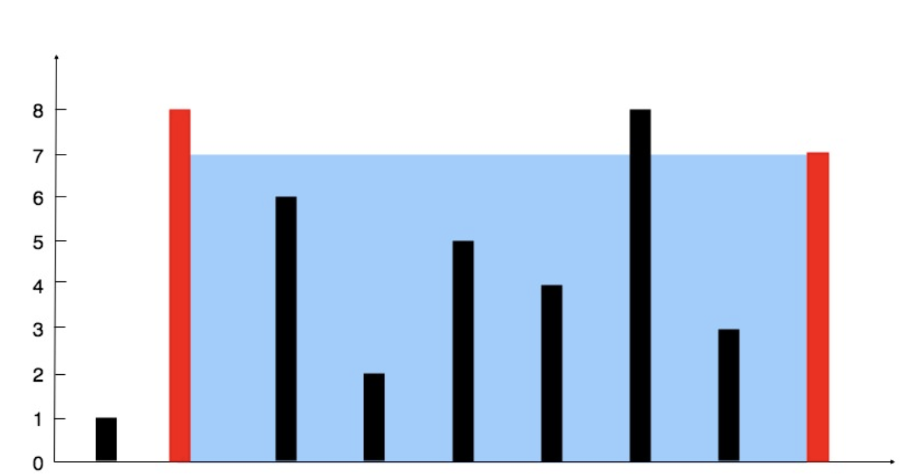

# 11. Container With Most Water



Area由宽度和高度决定，宽度是2条线的差，高度是当前2个指针的min。
## Brute Force

列出所有组合。

Time Complexity: $\mathcal{O}(n^2)$

Space Complexity: $\mathcal{O}(1)$


```python
class Solution:
    def maxArea(self, height: List[int]) -> int:
        m = 0
        for i in range(len(height)):
            for j in range(len(height)):
                if j > i:
                    l = j - i
                    h = min(height[i], height[j])
                    area = l * h
                    if area > m: m = area
        return m
            
```


## 双指针，greedy。
指针分别放在两端不断向中心靠近。

Time Complexity: $\mathcal{O}(n)$ 只需iterate一次。

Space Complexity: $\mathcal{O}(1)$

### 如何选择移动的指针
移动的那个必须是当前的`min`。
Area由宽度和高度决定，高度是当前2个指针的min。
当指针在向中心移动时，宽度一定在缩小，若想让area变大，只能希望高度变高。

#### Case 1: 移动height为min的指针
移动后，宽度一定变低，如果移动的不是height为min的指针，高度永远不可能变高。如果移动的是height低的那个，则有可能最终达到高的那个的height。
#### Case 2: 当2个指针所指高度相同时，随机选一个
**不论移动那个指针，下一步的min height都不可能超过当前的height。**
不论移动的是哪个，宽度都缩小了，高度都不会变，因为下一次的Area由两个指针的min height决定，而当前2个指针高度相同，下次的min height是at most当前的高度。所以当前移动一次之后area一定变小。就算之后area会增加也是之后几步希望2个指针都移动到更高的height上。
既然如果area要变大的话2个指针都必然会移动，那么当前移动那个一个就不重要了。
因为这算是一个Greedy Algorithm，我们每一步只需要care当前的最优解就好了。


```python
class Solution:
    """
    Runtime: 128 ms, faster than 86.21% of Python3 online submissions for Container With Most Water.
    Memory Usage: 15.4 MB, less than 35.33% of Python3 online submissions for Container With Most Water.
    """
    def maxArea(self, height: List[int]) -> int:
        m, s, e = 0, 0, len(height) - 1
        while s != e:
            area = (e - s) * min(height[s], height[e])
            if area > m: m = area
            if height[s] < height[e]: 
                s += 1
            else:
                e -= 1
        return m
```

